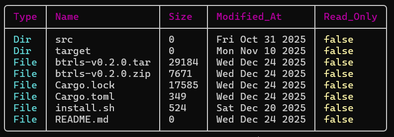

# `btrls`
A tabled `ls` command developed in Rust with color-coded columns. The basic functionality has been implemented in the release `v0.2.0`. 

With `btrls` you can see the files and directories in a tabled format with the option to export the details of files and directories as **JSON** with the `--json` or `-j` flag.



## Building the application
Clone the Repository. Make sure that you have `rustc` and `cargo` installed on you system. Then run the following command:
```bash
cargo build -r
```
Then you can find the application in the `<Path-to-repo>/target/release/btrls` or `<Path-to-repo>\target\release\btrls.exe` (If you are on a Windows Machine).

## Installation
Please refer to the releases section for the below mentioned files.
### For Windows
If you are on a Windows Machine, you can download the `btrls-v0.2.0.exe` executable file and add the location of the downloaded application to the System or User Environment Variables.

And you can also compile the application from source by either downloading an archive or cloning the repository then building the application with `cargo`.

### For Unix/Linux
If you are on a Linux or Mac Machine, you can download any of the archives from the releases or clone the repository and run the `install.sh` script.

**Note**: Make sure that your system already has `rustc` and `cargo` installed. 

For `bash` shell, the install script will add `btrls` to `PATH` environment variable through `.bashrc` file. If you are using any other shell, you will have to do that manually.

## Usage:
```bash
btrls [OPTIONS] [PATH]
```

## Arguments:
```bash
[PATH="."]
```
## Options:
### JSON data
```bash
-j, --json
```
Presents the current directory in JSON format

### View all files (including hidden)
```bash
-a, --all
```
Displays all the files and directories (including hidden ones)

### View Hidden Files only
```bash
-o, --only-hidden
```
Displays the hidden files and directories only

### Help
```bash
-h, --help
```
Print help (see a summary with `-h`, detailed help with `--help`)

### Version
```bash
-V, --version
```  
Prints version of btrls